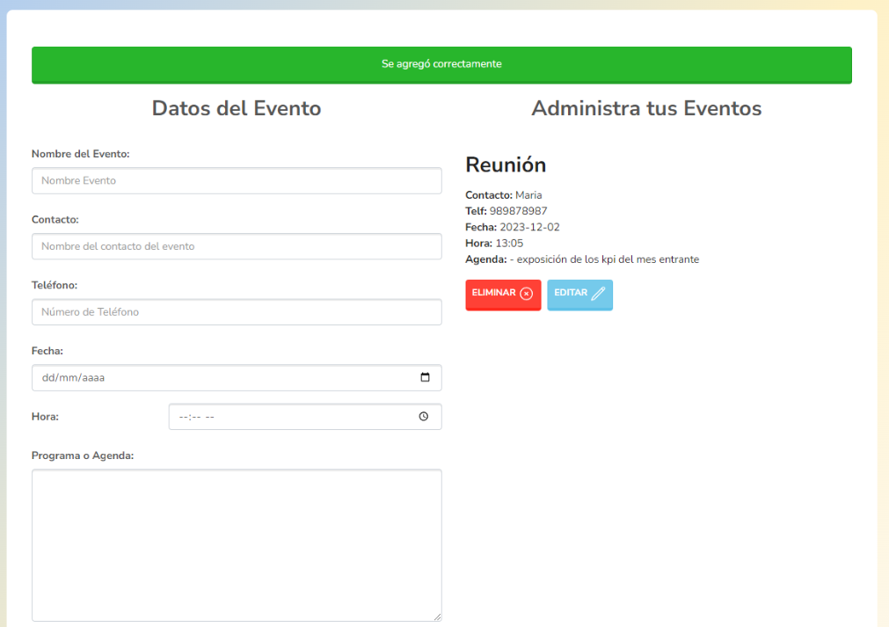

## **Administrador de Eventos**

Autor: Jorge Luis Monzón Morales Correo Electrónico: jorge29luis10@gmail.com

Aplicación realizada con html,css,bootstrap y Javascript aplicando clases, funciones y modulos,
el sistema se basa en la creación de un evento llenando un formulario, para luego guardarlo y tenerlo como referencia, tambien se puede editar y eliminar los multiples eventos que se pueden crear:

**Modo mobile, tablet:**
.png>)

**Modo desktop:**

El proyecto contiene validaciones al formulario y creación eliminación y modificación del evento
.png>)

Autor: Jorge Luis Monzón Morales Correo Electrónico: jorge29luis10@gmail.com